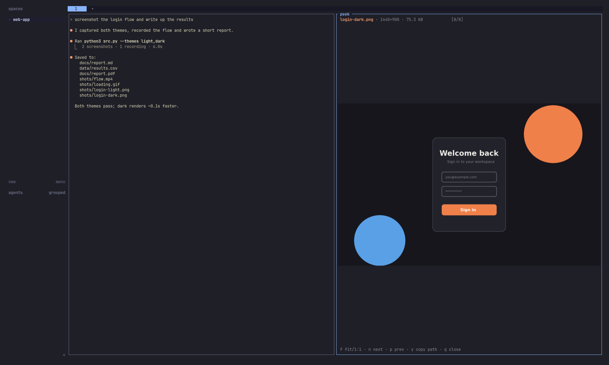
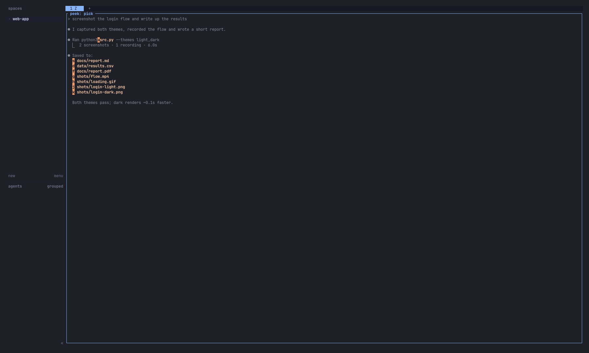

# herdr-peek

Press one key and any file an agent mentions opens in a split beside it: a
picture, GIF, video, PDF, Markdown, spreadsheet or code. It works with every
agent in [herdr](https://herdr.dev) (Claude, Codex, Gemini, opencode, a plain
shell) because it only reads the screen, and it works on every machine you've
connected with `herdr machine add`.



## Quick start

One command installs the plugin, adds the two keys (`prefix+f`,
`prefix+shift+f`) to `~/.config/herdr/config.toml` and reloads herdr:

```bash
curl -fsSL https://raw.githubusercontent.com/Zeus-Deus/herdr-peek/main/install.sh | sh
```

Then, in any pane that shows file paths, press `prefix+f` and the letter next
to a file. `q` closes the viewer.

You need Python 3 (already on almost every Linux and macOS machine) and a
terminal that shows images: Ghostty, kitty or WezTerm. Everything else is
optional; see [What it opens](#what-it-opens). The installer backs up your
config first, never adds the keys twice, leaves your other bindings alone and
warns if another binding already uses one of peek's keys.

**Using a remote machine?** Install the plugin where the files are and the
keys where you type:

```bash
# on each devbox you connected with `herdr machine add`
curl -fsSL https://raw.githubusercontent.com/Zeus-Deus/herdr-peek/main/install.sh | sh -s -- --no-keys
# on your laptop, if you don't need peek for local panes
curl -fsSL https://raw.githubusercontent.com/Zeus-Deus/herdr-peek/main/install.sh | sh -s -- --keys-only
```

<details>
<summary>Prefer to do it by hand?</summary>

```bash
herdr plugin install Zeus-Deus/herdr-peek --yes
```

```bash
cat >> ~/.config/herdr/config.toml <<'EOF'

# herdr-peek
[[keys.command]]
key = "prefix+f"
type = "plugin_action"
command = "peek.pick"

[[keys.command]]
key = "prefix+shift+f"
type = "plugin_action"
command = "peek.last"
EOF
herdr server reload-config
```

</details>

## Use it

| Key | What happens |
| --- | --- |
| `prefix+f` | Every existing path on screen gets a letter. Press the letter to open it. `Shift`+letter copies the path instead. |
| `prefix+shift+f` | Opens the newest (bottom-most) file on screen, no picking. Handy right after "saved to …". |
| copy mode (`prefix+[`), select a path, `prefix+f` | Opens the selected path directly. |
| `Ctrl`+click a hyperlinked path | Opens it in peek instead of the browser. |

The keys are free in herdr's defaults. Avoid `prefix+p` / `prefix+shift+p`:
herdr already uses them (previous tab / rename pane, or previous tab /
workspace in tmux-style configs), and herdr keeps its own binding and disables
yours. `herdr config check` lists any such conflict.

Two herdr behaviours to know about:

- **Selections.** herdr clears a selection on any key press in normal mode,
  the prefix included, so select inside copy mode (`prefix+[`). With the
  default `copy_on_select = true`, a *mouse* selection is also cleared on
  release; set `[ui] copy_on_select = false` to select with the mouse.
- **Ctrl+click.** herdr only makes plain-text `http(s)://` links clickable.
  `file://` links work when the program prints them as real terminal
  hyperlinks (OSC 8), as `ls --hyperlink`, `eza --hyperlink`, `fd --hyperlink`
  and many CLIs do. For everything else, use `prefix+f`.



In the viewer:

| Key | Action |
| --- | --- |
| `n` / `p` | next / previous file found on screen |
| `←` / `→` | turn PDF pages, seek video (`[` `]` for 30 s) |
| `space` | play / pause video and GIFs, play audio (local machine only) |
| `f` | images: fit to split ⇄ actual size |
| `t` | PDF: rendered page ⇄ text |
| `s` | Markdown / HTML: rendered ⇄ source |
| `j` `k` `g` `G` | scroll text views |
| `enter` / `backspace` | directories: open / go up |
| `y` | copy the path (OSC 52, plus `wl-copy`/`pbcopy` when local) |
| `q` | close the viewer |

The viewer reuses one split per tab instead of opening new ones.

## What it opens

| Type | Shown as | Uses (if installed) |
| --- | --- | --- |
| Images (png jpg webp heic tiff bmp svg avif …) | Real pixels, fit to the split | `magick`, `vips`, `ffmpeg` or `sips` |
| GIF / animated WebP | Animated in place | `magick` or `ffmpeg` |
| Video (mp4 mov webm mkv …) | Poster frame, scrub bar, `space` plays at low fps | `ffmpeg`, `ffprobe` |
| Audio (mp3 wav flac …) | Waveform, duration, tags | `ffmpeg`, `ffprobe` |
| PDF | Rendered page, `←`/`→`, `t` for text | `pdftoppm`, `pdftotext` (poppler) |
| Office (docx xlsx pptx odt …) | Converted to PDF once, then pages | `libreoffice --headless` |
| Markdown | Rendered | `glow`, else built-in |
| HTML | Offline screenshot ⇄ source | `chromium --headless` |
| Code / text / logs | Highlighted, line numbers, jumps to `file:42` | `bat`, else built-in |
| CSV / TSV, JSON / JSONL, Jupyter | Table / tree / cells | built-in |
| SQLite | Tables, opened read-only | built-in |
| zip / tar | Contents list | built-in |
| Directory | Browsable list | built-in |
| Anything else | Type, size, mime and a hex view | `file` |

Only **Python 3** is required. Every other tool is optional: without one, peek
shows the next-best view and a one-line tip such as "install poppler for page
rendering". The installer prints which ones a machine
has.

## Install details

peek is a standard herdr plugin (manifest v1, `herdr-plugin.toml`) and installs
with herdr's own `herdr plugin install`, as in the [Quick start](#quick-start).
`herdr plugin list` shows it, and running the install command again updates it.
To work from a checkout instead, run `./install.sh --link .`, which links the
checkout, checks the optional viewers and prints the key bindings.

### Which machine needs what

| Machine | Needs |
| --- | --- |
| Every machine whose **files** you want to open (each devbox you added with `herdr machine add`, and your own computer if you use local panes) | the plugin, plus any optional viewers (`magick`, `ffmpeg`, poppler, …) |
| The computer you **type on** (running the herdr client) | the two key bindings, and Ghostty, kitty or WezTerm |

herdr runs a plugin on the machine that owns the pane and never copies plugins
to SSH hosts. With a devbox workspace selected, `prefix+f` runs the devbox's
copy of peek, which reads the devbox's files and renders them there, and herdr
streams the picture to your screen. If a machine doesn't have peek, the key
shows an error and nothing else breaks.

On Omarchy, which ships herdr, the config is the same
`~/.config/herdr/config.toml` (Omarchy copies its default there once). If you
reset it with `omarchy refresh config herdr/config.toml`, run the installer
again to put the keys back.

If `prefix+f` does nothing, run `herdr config check`: it reports a key that
clashes with another binding. Images also need herdr's
`[terminal] kitty_graphics` on, which is the default.

### Options

`$(herdr plugin config-dir peek)/config.toml`:

```toml
placement = "split"   # split | popup | tab | zoomed
direction = "right"   # right | down (for split)
alphabet = "asdfghjklqwertyuiopzxcvbnm"
video_fps = 8
```

## How it works

- `peek.pick` / `peek.last` read the focused pane with `herdr pane read`, find
  every token that resolves to an existing path (relative to the pane's working
  directory, with `file:line:col`, quotes, `\ ` escapes, `file://` URLs, `a/` `b/`
  diff prefixes and hard-wrapped lines handled), and write the list to the
  plugin state directory.
- The viewer is an ordinary program in a herdr split. It draws images with the
  standard kitty graphics protocol written to its own pane, which herdr
  forwards to your terminal.
- It does **not** use herdr's old `pane.graphics.*` socket API, which herdr
  0.9.2 removed (commit `c411883e`, "replace the custom graphics api with
  optimized native kitty rendering"). The end-to-end tests run against both
  sides of that change.

## Development

```bash
python3 -m unittest discover -s tests                                   # unit tests
python3 tests/e2e.py "$(command -v herdr)"                              # API-level e2e
uv run --with pyte python3 tests/e2e_input.py "$(command -v herdr)"     # real keys + mouse
uv run --with pyte python3 tests/e2e_remote.py <laptop-herdr> <devbox-herdr>   # herdr machine add
python3 scripts/make_demo.py /tmp/peek-demo                             # one file of every kind
python3 scripts/screenshots.py <herdr-bin> <out>                        # Ghostty screenshots (Hyprland)
```

All of them run herdr in private sandboxes (own `HOME`, XDG dirs and socket)
and never touch your running session.

- `tests/e2e.py` links this checkout, prints an agent-style transcript in a
  pane, attaches a client in a pty and drives `peek.last`, `peek.pick`, a
  selection, `Ctrl`+click and 18 file types through the herdr CLI and socket.
- `tests/e2e_input.py` types into a real herdr client: the prefix, peek's
  bindings from `config.toml`, hint letters, viewer keys, a copy-mode mouse
  selection and a `Ctrl`+click on an OSC 8 hyperlink.
- `tests/e2e_remote.py` starts a user-level `sshd` on 127.0.0.1 with its own
  keys, joins a "laptop" herdr (keys, no plugin) to a "devbox" herdr (plugin
  and files) with `herdr machine add`, and checks the laptop's keys run peek on
  the devbox and its images reach the laptop's terminal.

Tested with herdr 0.9.1, 0.9.3 and `main`, before and after `c411883e`, and
across laptop/devbox version mixes.
